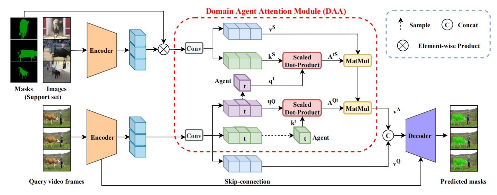

# Domain Agent Network

## Overview

This code is for the paper "Delving Deep into Many-to-many Attention for Few-shot Video Object Segmentation" in CVPR2021.

The architecture of our Domain Agent Network: 



## Environment

```
conda create -n FSVOS python=3.6
conda activate FSVOS
conda install pytorch==1.6.0 torchvision==0.7.0 cudatoolkit=10.2 -c pytorch
conda install opencv cython
pip install easydict imgaug
```


## Usage

### Preparation

1. Download the 2019 version of [Youtube-VIS](https://youtube-vos.org/dataset/vis/) dataset.
2. Put the dataset in the `./data` folder.
```
data
└─ Youtube-VOS
    └─ train
        ├─ Annotations
        ├─ JPEGImages
        └─ train.json
```
3. Install [cocoapi](https://github.com/youtubevos/cocoapi) for Youtube-VIS.
4. Download the ImageNet pretrained [backbone](https://drive.google.com/file/d/1PIMA7uG_fcvXUvjDUL7UIVp6KmGdSFKi/view?usp=sharing) and put it into the `pretrain_model` folder.
```
pretrain_model
└─ resnet50_v2.pth
```
5. Update the `root_path` in `config/DAN_config.py`.

### Training

```
python train_DAN.py --group 1 --batch_size 4
```

### Inference

You can download our `pretrained` [model](https://drive.google.com/drive/folders/1aJh8awU3X4a_BoIQMOLeqKMlLR8naNFU?usp=sharing) to test. 

```
python test_DAN.py --test_best --group 1
```


## References

Part of the code is based upon:

+ PMMs: https://github.com/Yang-Bob/PMMs
+ PFENet: https://github.com/Jia-Research-Lab/PFENet
+ STM-Training: https://github.com/lyxok1/STM-Training

